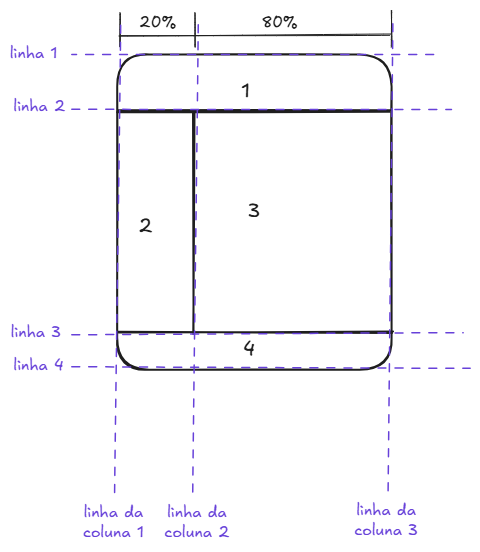

# Revisão

## 🚢 Navegando entre diretórios
- Diretório abaixo: `./`
- Diretório acima: `../`

## 🔤 Primeiros passos com HTML
- Estrutura básica do HTML: `! + tab`
- Vincular um css externo: 
    - dentro do `head` insira `<link rel="stylesheet" href="./css/style.css">` 
    - ou digite `link + tab`

## 🎨 CSS
A estilização pode ser feita de forma externa, interna ou inline em relação ao html.

### CSS externo
CSS externos são definidos pela tag `<link>` dentro do `head` do HTML. 
Exemplo de arquivo .css:
```
body {
  background-color: lightblue;
}

h1 {
  color: navy;
  margin-left: 20px;
}
```
### CSS interno
CSS internos são desenvolvidos dentro do código html, representados pela tag `<style>`.
Exemplo de css interno:
```
<!DOCTYPE html>
<html>
<head>
<style>
body {
  background-color: linen;
}

h1 {
  color: maroon;
  margin-left: 40px;
}
</style>
</head>
<body>

<h1>This is a heading</h1>
<p>This is a paragraph.</p>

</body>
</html>

```
### CSS inline
CSS inline é utilizado para aplicar um estilo a um único elemento.
Exemplo de css inline:
```
<!DOCTYPE html>
<html>
<body>

<h1 style="color:blue;text-align:center;">This is a heading</h1>
<p style="color:red;">This is a paragraph.</p>

</body>
</html>
```
## Flexbox x Grid
TODO: explicar quando usar cada um e atributos de cada

### Flexbox

### Grid
No arquivo .css use `display: grid` para atribuir ao elemento e aos seus filhos essa configuração.
Opções para criar número de colunas:
- `grid-template-columns: auto auto auto`: cria três colunas de tamanhos iguais;
- `grid-template-columns: 1fr 2fr 1fr`: cria três colunas, sendo a segunda 2x maior do que as primeira e terceira;
- `grid-template-columns: 20% auto auto`: cria três colunas, com a primeira fixada em 20% e as demais ajustam automaticamente a área disponível;
- `grid-column: 1/3`: elemento inicia na linha 1 de coluna e termina na linha 3 de coluna
- `grid-column: 1/span 2`: elemento inicia na linha um e termina em mais duas linhas

Para linhas a lógica é a mesma, só altere o comando de `column` para `row`;

### Exemplo desenvolvido


## Usando o Flask
Abra o terminal `(ctrl + ")`
Crie a estrutura de organização padrão do Flask. 
|-- static
|   |-- style.css
|
|-- templates
|   |--index.html
|
|-- app.py

### app.py
```
from flask import Flask

app = Flask (__name__)

@app.route("/")
```

### Instalação do Flask
1. Verifique se tem o python instalado: `python --version`
2. Crie um ambiente virtual: `python -m venv venv`
📢 A pasta venv não deve ser subida no repositório. Para isso, adicione ao .gitignore.
3. 